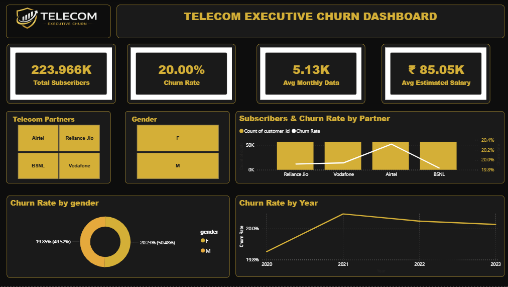

# 📊 Indian Telecom Customer Analytics

An end-to-end Data Analytics project that analyzes telecom customer behavior, usage patterns, and churn using **SQL, Python, and Power BI**.

## 🚀 Tech Stack

- SQL
- Python (Pandas, NumPy, Plotly, Matplotlib)
- Jupyter Notebook
- Power BI

## 📂 Project Structure

```
📁 Dataset
📁 SQL
📁 Python
📁 PowerBI
```

## 📊 Project Workflow

- Data Cleaning & Validation (SQL)
- Exploratory Data Analysis (Python)
- Business Insights
- Executive Dashboard (Power BI)

## 📈 Dashboard



## 🔍 Key Insights

- Measured customer churn across telecom partners.
- Analyzed customer demographics and usage behavior.
- Identified high-value customer segments.
- Explored regional customer distribution.
- Built an executive dashboard for business decision-making.

## 👩‍💻 Author

**Aditi Paitandy**

GitHub: https://github.com/aditipaitandy
